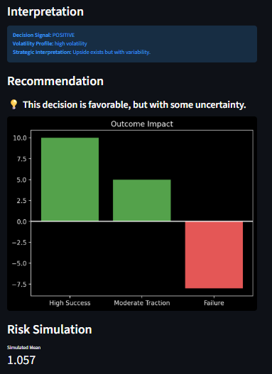
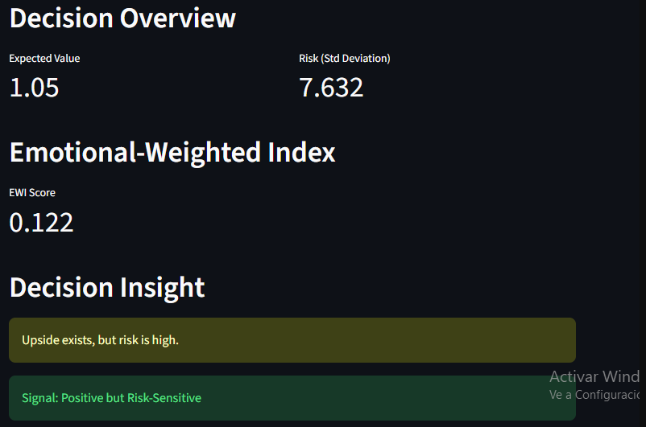

# Daniela Luna Cadena

Welcome to my Data Analytics portfolio.

# About Me

Business Administrator transitioning into Business & Data Analytics, with a strong interest in business intelligence, customer insights and strategic decision-making.

I enjoy transforming raw data into actionable insights through dashboards, visualization and storytelling-focused analysis, combining a solid business management background with technical analytics skills to turn data into real decisions.

### Technical Skills

- Data analysis and manipulation with **Python (Pandas, SciPy)** and **SQL**
- Data visualization and storytelling with **Matplotlib, Seaborn, Plotly, Tableau, Dash**
- Interactive dashboard development with **Streamlit**
- Version control with **Git and GitHub**

### Soft Skills

Analytical thinking | Data-driven decision-making | Effective communication | Project management | Proactivity | English (B2)

---

# Featured Projects

## 🧠 Decision Lab

**The most important life decisions are rarely 100% rational — they combine objective data, probability, risk and emotional impact. Decision Lab is a hybrid model that quantifies both, helping people make more informed and conscious decisions under uncertainty.**

#### Tools & Project Type

### Key Questions
1. How can decisions that combine objective data with subjective emotional impact be evaluated?
2. Which decision offers the best balance between expected benefit and risk taken?
3. How can we quantify whether a decision is "worth it" beyond intuition?

### Methodology
- **Scenario definition:** for each decision, possible outcomes are identified, along with their probability and impact (objective and emotional).
- **Expected Value (EV):** weighted average of outcome impacts by their probability — `EV = Σ (Probability × Impact)`.
- **Risk estimation:** standard deviation of possible outcomes, used as a measure of uncertainty.
- **Emotional Weighted Index (EWI):** penalizes EV based on the level of risk — `EWI = EV / (1 + Standard Deviation)`.
- **Monte Carlo simulation:** models the full distribution of possible outcomes to validate the robustness of the recommendation.
- **Interactive Streamlit dashboard** to explore different decision scenarios in real time.

### Conclusions & Recommendations
The EWI is interpreted as a confidence scale for action:
- **EWI > 1:** high expected benefit with controlled risk → strongly pursue the decision.
- **EWI > 0:** favorable decision, but with relevant uncertainty → proceed with caution.
- **EWI between -0.5 and 0:** fragile decision → more information is recommended before acting.
- **EWI < -0.5:** risk outweighs expected benefit → decision not advisable in its current form.

### Highlighted Visualizations
<!-- Upload your screenshots to an assets/img folder in the repo and update the paths below -->

🔗 [Repository](https://github.com/danielalunacadena/decision_lab) · 🔗 [Live Demo](https://decisionlab-9uicczafrxvvqnsx77xappj.streamlit.app/)

---

Hosted on GitHub Pages
